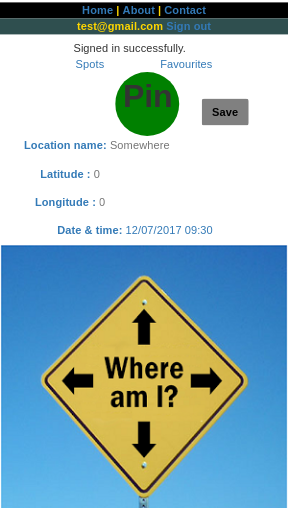

# README
Motivation / Objective:

* To create an app which easily saves places (with just one click) e.g. where you park and take you there when you want to return.
* Before starting to built the app, survey conducted using https://docs.google.com/forms/d/e/1FAIpQLSd1ethIS_uZsVv2Gr93t-Ur0foavo9OZKlWbDinJDDHRhK19Q/viewform?c=0&w=1   

* EDR:

* The Mockup of the program

Benefits:
  * Reduce the time and effort you spend to find your car
  * Enable you to save important and interesting places quickly while are just passing
  * Helps to memorize important places when you go to new countries/ cities

Technologies used:
  * HTML, CSS, Ruby on Rails, and JavaScript

Version:
  * Ruby 2.3 used to built this application

System dependencies
  * All the system dependency are listed in the Gemfile.

  Database creation:
    * The Database is created using Postgresql

  Deployment:
    * The app deployed using Heroku.  

  Before running the program:
    * rails db:drop db:create db:migrate db:seed

  Some of the challenges:
    * Getting current location. Finally done.
    * Integrating Ruby and JavaScript together. But finally done.
    * Some CSS formatting and improving functionality. Still to be done.

  Future works include:
    * To connect to Google map and search a path, distance and time.
    * To change this application in order to fit Android and other operating systems

  Screen shot of the image be found from image directory.
    
